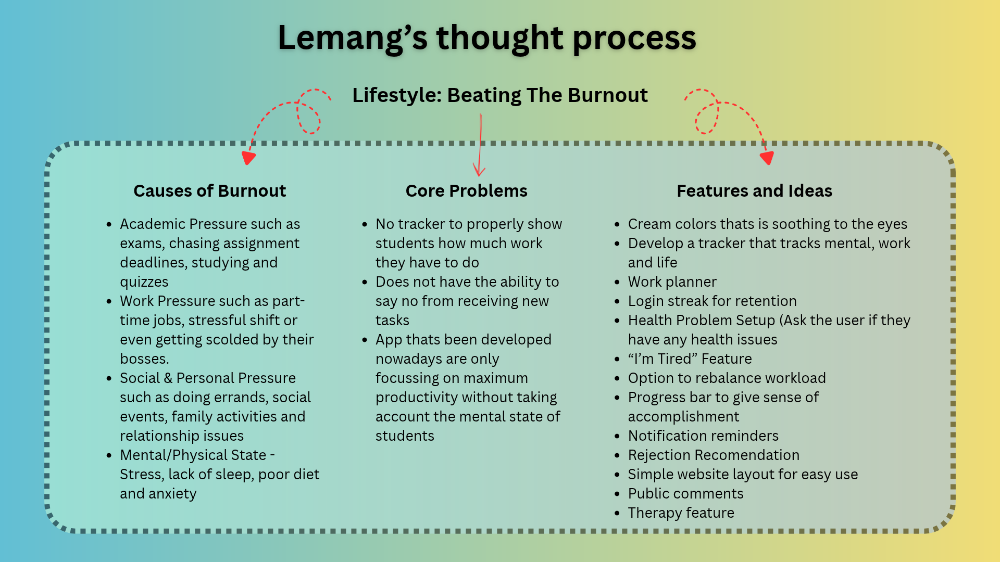

# CodeNection-2026-Competition-Lemang-

ORe2 by Lemang

================ Group Info ==================
Group : Lemang
Member 1: Luqman Hakim Bin Muhammad Fahmi
Member 2: Emil Shadiq Bin Iskandar
Member 3: Arfa Mirza Bin Shamsul Safuan
Member 4: Dairell Hannan Bin Ahmad Nizam

Problem Statement: Stress & Workload Manager
Video Presentation:
Presentation Slides:


============== Project Overview ==============

The problem

- Students in universities are stressed and overloaded with the amount of task they needed to do from assignments to part-time jobs. They do not know how much weight they are carrying on their backs which prompt them to procastinate the less urgent work that will backfire and hence, leads to stress and workload overload. Applications have been developed in the past to help students balance better such as Motion and Reclaim.ai. They're AI-driven calendar assistance which on paper sounds amazing, but they're heavily focussed on maximum corporate productivity and not energy management, which does not solve the problem of student burnout and consequently fails to retain the amount of students using their website. 

Our solution

- Our solution is building a website that tracks their well-being in terms of mental state and tracks the workload all in one for universities students to utilize. Our feature such as work planner allows our user to plan their work by how heavy the work is such as light, medium and heavy. If the user does too much heavy task, our website might tell the user to take a break and suggest activity or recovery suggestion so the user can relax their mind. With lessons from failed developed applications, we are focussing on balancing the workload so the user is free from overload. In addition, we aknowledge that we can not fully prevent student burnouts as it will happen regardless of our website or not but we are determine on minizing the chances with the feature we will be implementing on our website.


Core Features
- Work Planner
- Progress Bar (Work Completed & Congratulate the user)
- Multi-Domain Tracker (Tracks work, life and mental state)
- Rebalance Workload 
- "I'm tired" feature (It hides heavy and medium task)
- Reminder Notification & Sanity Check (Ask how the user feel - Good, Happy, Sad)
- Login Streak (For retention)
- Rejection Recommendation (Suggests nice ways to reject tasks)
- Recovery Suggestion (Based on user input)
- Health Problem Setup (Asks the user if they have any health issues before signing up)


============== Ideation and Process ==============

2.1 Ideas We Considered

Chosen Ideas

Why we chose the Lifestyle Track titled Beating the Burnout instead of Planning an Escape?

- We have aknowledge that a large part of students, even graduates are struggling with stress and workload, which motivated us to create a solution. We also are experiencing the stress and workload given to us, which relates us to the issue. In addition, as a student, we do not travel often which heavily influence our decision for the topic.
- Broader market reach is also one of the reason why we chose Beating the Burnout as the volume of students struggling are significantly more than the number of people that travel each year which makes our research easier as there are many studies we can refer.
- Innovation potential, as we know preventing stress and workload would allow our team to deliver a sophisticated features that will be in our website.

Work Planner & Progress Bar

- This idea was chosen because work planner can help our user which is university students to plan their work effieciently as they can choose whether the work is light, medium or heavy with the ability to set the required time to finish it. Future plans enable students to organise it into a schedule where they can simply drag and drop the work in anyday of the week
- We decided to add progress bar because giving our user a sense of accomplishment is essential to keep the user motivated to keep going and the satisfaction of completing their set task

Multi-Domain Tracker, Rebalance Workload and "I'm Tired" Feature

- Multi-Domain Tracker in our website means that it not only track work they have set but also their life and mental state of our user which our team has collectively agreed that it would be one of our unique features as other similar applications only tracks the work aspect to maximise productivity.
- Linked to the Multi-Domain Tracker, we decided to add Rebalance Workload that is calculated based on work, life and mental state of our user to prevent any burnouts. If the tracker detected high workload, the user can simply click it and it will rebalance everything to optimise health conditions.
- Some users often already spent their energy doing something else during the day and will be too tired to do work but still wants to complete some task. Our team decided to add the feature "I'm Tired" that hides heavy and medium tasks and only light tasks for the user to complete, which still gets the work finished without the jeopardizing their mental health state.

Login Streak, Reminder Notification

- To keep users to keep using our website, we decided to implement login streak so that our user has a reason to go to our website whether to preserver their streak or use our site to manage work, life and mental health.
- We also decided to add reminder notification for our users that will give reminders that range from work has not been completed to checking if they are okay or not in terms of health.


Rejection & Recovery Suggestions

- For rejection suggestions feature, we have indentified that some users struggles to say no when people offer them new tasks despite having a lot of tasks needed to complete because of them being scared to say no or just too kind so our team wants to help reduce burnouts by giving suggestions on how to reject politely that they can simply copy and paste.
- For recovery suggestions, we want to give activities that the user can do when they feel overwhelmed that might calm them down or just simply want to find any activities to do during their leisure time.

Health Problem Setup

- This will be our main unique feature. Before signing up, our website will ask if the user has any health issues they would like to address and if they have, we can uniquely customise the workload based on their health conditions.


Rejected Ideas

Locked Website

- This idea is presented to lock the website if the user has already done too much work, preventing any access into our website for a period of time.
- Most of us agrees that locking user from our website would be unecessary as it would simply make them search for another website if they are locked. Imagine if our user has a deadline thats due very soon and our website locked the user out preventing them to track what they have done and havent done, hence creating rage, anxiety and more stress which goes against what our website is built for.

AI Bot

- This idea is proposed to help user if they need help by replying to any question they have but we decide not to proceed because it is way too ambitious for us since it is our first time participating in CodeNection.

Digital Pets

- The idea was for the user having the option to have digital pets as their companion during the use of our website. It can act as a stress reliever as you can name, pet and do tricks with the pet which we see potential in reducing the stress and anxiety when having tons of work to do. However we would have animate the pet which would take too much time for the limited period of time we have during our competition.

Public Comments

- We initially want to make that users can share their profile/work progress with other people and allow users to comment on the post to encourage each other building a community that supports each other. However, we realise that people would complete their task just to show other people their progress rather than focussing on balancing their workload to prevent burnouts. We want to encourage balance not chasing clout.

Shared Task

- This was a good idea where people can help each other task by helping them complete it but we realise that it will be easily abused by people thats too lazy and just put their assignment up for other people to do it, which is why we did not proceed with the idea.

Pay if task not completed

- If we start to charge people for not completing their task, they would simply just switch website or application which we do not want. We build the website with the sole purpose of helping students preventing burnouts not extracting as much money as possible from our user.


2.2 Ideation Board

Here's our initial discussion for ideas.


Here's our indetified core problems.


Here's our 2nd discussion during our brainstorming session on an interactive board.



Here's how our initial thoughts on how the program should work from start to finish, covering all features.


Here's our current website progress and it's version as we continue to build our website.


============== Mentor Consultation ==============

Below are our conclusion on our mentorship session during our prototype phase:

| Date | Mentor | Feedback Received | What was changed |
-----------------------------------------------------------------------------------------------------------------------------------------
| 7/9/2026 | Faris Imran | - Our initial idea was very general and we should focus more on something that stands out and unique that is only available to our website. | We added a feature where it asks the user for any health problem and customise the website setup based on the user health problem. However, we still inteded to keep the initial features on our website to make people stick to our website alongside the unique feature. |
-----------------------------------------------------------------------------------------------------------------------------------------
| Row 2 Data | Row 2 Data | Row 2 Data | Row 2 Data |

============== Design & Prototype ==============

Below we will share our website design using canva and showcase what the currect actual website currently has

UI Prototype : https://canva.link/2jphwxxks8f2sro

Prototype Website: https://canva.link/y3d2wyircc3vyp3

Instructions on how to run our website prototype using app.py:

1. Install Python 3.10+.
2. Open a terminal in this folder.
3. Install dependencies: ```bash pip install -r requirements.txt```
4. Start the site: ```bash python app.py```
5. Open `http://127.0.0.1:5000`.

If you're still confuse how to open it, we have prepared a visual on how to run the prototype.


============== What Makes It Different ==============

We have some unique features that makes our website supperior in comparisons to others as we have features such as Health Problem Setup and Multi-Domain Tracker.

Health Problem Setup

As stated, during the signing up process, our website would ask the user if they have health problems or not and if they do we would alter the workload planner that is suitable for the user health conditions. We truly believe that this feature is what makes our website unique as other websites normally wouldn't ask if the user have health conditions or not and instead just plain work planner. With this feature, struggling students would certainly feel like they are being aknowledge and can be used to help them maintain their healthy lifestyle without giving them burnouts.

Multi-Domain Tracker

A tracker that would track would track other stuff like life and mental state rather than only tracking work progress is truly what sets our website apart from others as in research we noticed that they only focus on maximizing productivity without caring about the health state of their users. With our website, we aknowledge that users have feelings rather than numbers on a screen and with our feature it would help them track their well-being long before any burnouts hits.


============== Technical Architecture & Feasibility ==============


## Production note

The included secret key is for development only. For production, set a secure `SECRET_KEY`
environment variable and replace session storage with SQLite/PostgreSQL.